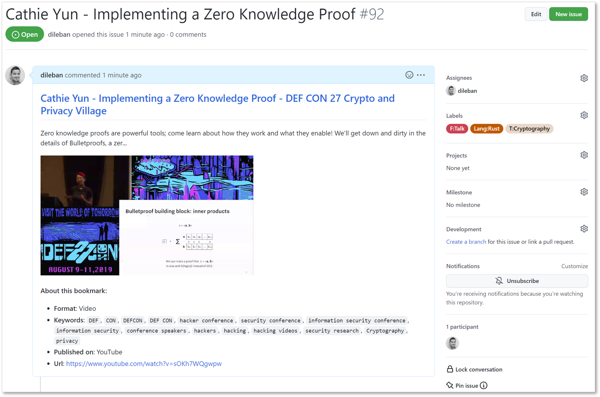

#  Minimal

## Summary

-   Minimal is a Chromium extension that helps minimize browser tabs by saving them as Github issues.
-   A tab can be saved as a new issue or appended to an existing issue as a comment.
-   Minimal also allows saving multiple tabs at once, useful when doing research on a particular topic.
-   Incorporate a Kanban workflow using Github Projects to work through saved tabs.

## Introduction

Minimal is a solution to the tab hoarding problem many of us face when surfing the web. Although we do rely on search engines to retrieve content we've seen in the past, more often than not we leave tabs open as personal reminders to attend to an article, paper or a podcast.

Minimal lets you save tabs as Github issues or comments so you can work through them structurally. Using Github to manage tabs has a number of benefits over traditional bookmarks:

-   Github labels let you categorize content based on topic.
-   Save additional information alongside the title and url.
-   Richer search capabilities for looking up saved content.
-   Apply a Kanban workflow to support your research work.

## Installation

Installing a browser extension is a relatively straight forward exercise and can be done either manually or via the Web Store.

### Chrome Web Store

Minimal is not available on the Chrome Web Store and might be added in due course.

### Manual

TODO

### Authentication and Security Considerations

When the extension is activated for the first time you will be prompted for a Personal Access Token (PAT). Minimal uses a PAT to authenticate with Github's APIs. To create a PAT follow [these](https://docs.github.com/en/authentication/keeping-your-account-and-data-secure/creating-a-personal-access-token) instructions.

The limition in using PATs is that they have broad access. Github doesn't allow scoping PATs to an individual repository although this might be addressed in future (see [#184](https://github.com/github/roadmap/projects/1#card-58542173) on Github's roadmap).

**NOTE**: Never trust code even if its source is open unless you personally inspect the code, or a snapshot of the code has been audited and signed-off by a trusted entity. Although this code uses a PAT for the sole purpose of creating issues and querying meta data from the _specified_ repository, the author holds no responsibilities for any breaches that might occur as a result of using this extension.

#### Extension Permissions

The extension relies on the following permissions:

-   _Tabs_: Access to browser tab instances and their underlying webpage.
-   _Scripting_: Code to fetch the _head_ element from a webpage's DOM in order to extract metadata.
-   _Storage_: Persist PAT, repository url and other metadata such as labels and assignees.
-   _History_: Date and time a webpage was loaded to compute the duration a tab was opened.

## Using Minimal

Minimal can be activated by:

-   Clicking on the extension's icon on the top right corner of the browser.
-   Using a keyboard shortcut: `Ctrl+Shitf+S` on Linux and Windows, and `Command+Shift+S` on MacOS.

When the extension is activated for the first time, you will be promoted to enter a valid PAT and repository URL.

### Saving a tab as a new issue

To save a tab as a new Github issue, activate the extension. The title and comment fields are filled automatically using meta data from web page. You may edit these fields and set one or more labels and assignees. Click _Save_ to create a new issue.

The comment field is automatically filled with preview information, which helps with searching and reviewing issues. The following is result of saving the tab shown above.

### Saving a tab as a comment to an existing issue

Use the _Comment_ option to save a tab as a comment to an existing issue. The following is an example of saving a tab showing a related project repository which Cathie Yun, the presenter above, helped co-author.

### Saving mulitple tabs at once

Sometimes it is helpful to save multiple tabs at once rather than having to save each tab individually. This is often the case when you find relevant content pertaining to a certain topic of interest.

When saving multiple tabs at once, you either have the option of creating a single issue with multiple comments or a series of individual issues.

## Contributing (reporting bugs, feature requests, pull requests, etc)

See [CONTRIBUTING](./CONTRIBUTING.md) for guidelines on how to help improve Minimal.
